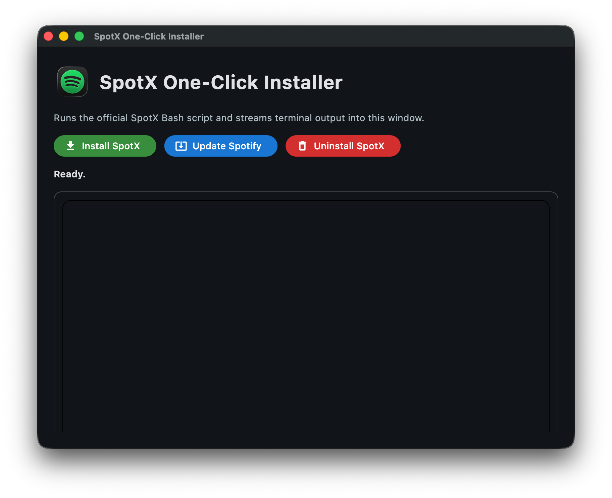

# SpotX-Patcher

One-click desktop GUI for installing, updating, or uninstalling SpotX with live terminal output.

## Overview

SpotX-Patcher is a lightweight Python + Flet app that wraps official SpotX scripts in a simple interface.

- Install SpotX
- Update Spotify client (macOS and Windows flows)
- Uninstall SpotX
- See real-time command output and exit codes inside the app

## Highlights

| Feature | Description |
| --- | --- |
| One-click actions | Install, Update, and Uninstall buttons |
| Live console | Streams stdout/stderr into the app |
| ANSI cleanup | Removes color escape codes for readable logs |
| Platform-aware behavior | Uses Bash flow on macOS/Linux and PowerShell flow on Windows |
| Simple setup | Single Python file app with minimal dependencies |

## Screenshot



## Requirements

- Python 3.11+
- Flet

## Quick Start

```bash
python -m venv .venv
source .venv/bin/activate
pip install flet
python updater.py
```

## How It Works

### macOS / Linux

Uses the official SpotX-Bash script for action-specific flows.

### Windows

Runs SpotX PowerShell commands with fallback mirror support.

Primary source:

```powershell
iex "& { $(iwr -useb 'https://raw.githubusercontent.com/SpotX-Official/SpotX/refs/heads/main/run.ps1') } -new_theme"
```

Mirror source:

```powershell
iex "& { $(iwr -useb 'https://spotx-official.github.io/SpotX/run.ps1') } -m -new_theme"
```

## Notes

- This project is a GUI wrapper around community SpotX scripts.
- Action behavior depends on upstream SpotX script options and compatibility.
- Keep Spotify closed during patch operations for best results.

## Troubleshooting

- If `flet` cannot be imported, verify your active virtual environment.
- If output looks broken, check network connectivity and script URL availability.
- If scripts fail, copy console output and inspect the failing command directly.

## Credits

This project is built on top of the official SpotX work. Full credit to the maintainers and contributors of:

- SpotX-Bash: https://github.com/SpotX-Official/SpotX-Bash
- SpotX: https://github.com/SpotX-Official/SpotX

## Disclaimer

Use at your own risk. This tool is not affiliated with Spotify.
